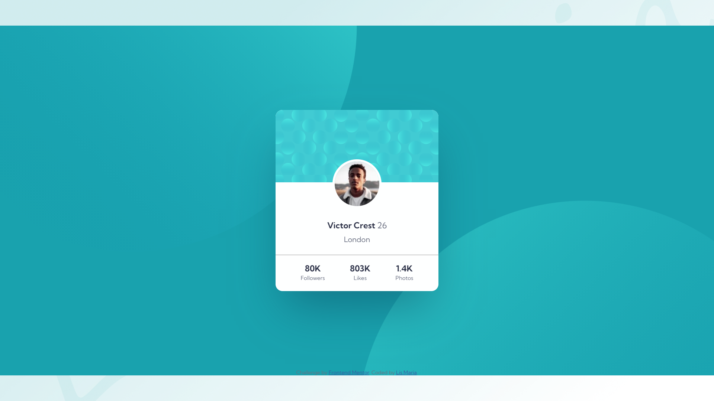

# Frontend Mentor - Profile card component solution

This is a solution to the [Profile card component challenge on Frontend Mentor](https://www.frontendmentor.io/challenges/profile-card-component-cfArpWshJ).

## The challenge

- Build out the project to the designs provided
- Screenshot
    
    

## Links

- ### Solution: [solution-link](https://github.com/lismaria/FM1-ProfileCardComponent)
- ### Live Site: [site-link](https://lismaria.github.io/FM1-ProfileCardComponent/)
- ### Blog Post: [dev.to](https://dev.to/lismaria/profile-card-challenge-frontendmentor-io-3d51)

## Built with

- Semantic HTML5 markup
- CSS custom properties
- CSS Flexbox
- CSS Grid
- CSS Animations
